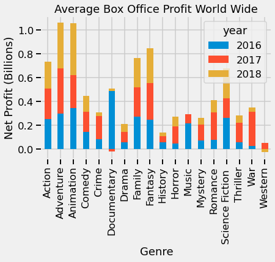
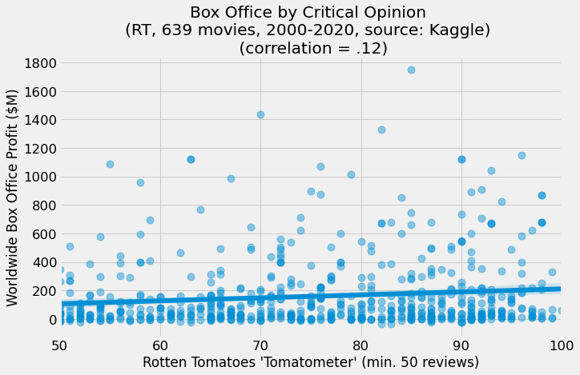
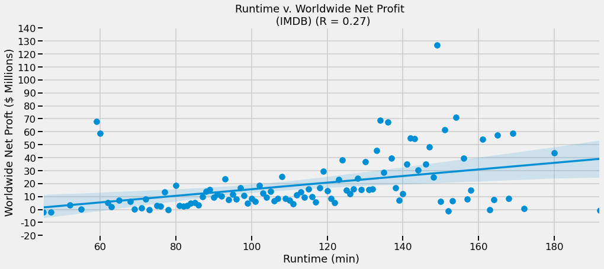

# Recommendations for the New Microsoft Movie Studio

**Authors**: *Ben Bowman, Nate Walter, Nina Vergara, Manav Kahlon*

- [Overview](#Overview)
- [Business Problem](#Business-Problem)
   - [IMDB](#IMDB)
   - [Rotten Tomatoes](#Rotten-Tomatoes)
   - [TheMovie](#TheMovieDB)
   - [The Numbers](#The-Numbers)
   - [Box Office Mojo](#Box-Office-Mojo)
- [Methods](#Methods)
- [Results](#Results)
    - [Rating v Box Office](#Comparing-box-office-Profit-by-MPAA-Rating)
    - [Genre v Box Office](#Comparing-the-Profits-of-Different-Genres-by-Year)
    - [Release Month v Box Office](#Comparing-Release-Month-to-Net-Profits)
    - [Critic Ratings v Box Office](#Comparing-Critic-Sentiment-to-Net-Profit)
    - [Runtime vs Box Office](#Comparing-Run-Time-to-Net-Profit)
- [Conclusions](#Conclusions)
- [For More Information](#For-More-Information)
- [Repository Structure](#Repository-Structure)


## Overview

   We are tasked with pitching three recommendations for Microsoft's first movie production. In order to do so, we will be utilizing datasets from a variety of sources that, when combined, contain records of movie box office numbers, genres, and individuals involved in creation and production. We will leverage this data to generate profit insights that drive our recommendations for critical aspects of movie production. In terms of box office revenue generation, we've found that adventure and animation genres consistently outpreform other genres. We've also determined that movies with a G rating, as well as those released in the months of May-July, yield the highest net profit. Surprisingly, critical acclaim cannot be used to predict box office success. In addition, movie runtime shows only a weak positive correlation with profit. Therefore, we suggest that Microsoft produce an animated adventure film with a G rating. Furthermore, we recommend that this movie be released in May, June, or July. 


## Business Problem

Microsoft wishes to enter a market still growing internationally (even though domestic box office is delcining slightly) which reached $42.5 billion in 2019 before the pandemic.

Our task is to use data to explore the types of movies that are doing well at the box office, and then make appropriate recommendations to the head of the new Microsoft Studio.


## Data

#### IMDB
    * imdb.name.basics.csv.gz
    * imdb.title.akas.csv.gz
    * imdb.title.basics.csv.gz
    * imdb.title.crew.csv.gz
    * imdb.title.principles.csv.gz
    * imdb.title.ratings.csv.gz

#### Rotten Tomatoes
    * rt.movie_info.tsv.gz
    * rt.reviews.tsv.gz
    * rotten_tomatoes_movies.csv

#### TheMovieDB
    * tmdb.movies.csv.gz
    
#### The Numbers
    * tn.movie_budgets.csv.gz
    
#### Box office Mojo
    * bom.movie_gross.csv.gz


## Methods

Our overall strategy is to merge the six IMDb datasets with TN, TMDb, and finally BOM. We want to compare various independent variables against box office returns. We can use domestic gross box office from the BOM and TN datasets, as well as worldwide gross receipts from TN. Then, by using the production budget values from TN, we can determine worldwide net receipts. Worldwide net receipts will be our dependent variable.

The two smaller RT datasets contain no movie titles that can be merged with the others (and only contain what is surmised to be gross domestic receipts). Therefore these datasets can be used for expoloratory purposes and to validate other results. The RT Kaggle dataset, however, can be merged with the larger datset for further exploration.

## Results

### Comparing box office Profit by MPAA Rating


When looking at the Worldwide Average Box Office Profit compared to Movie Rating some important results can be interpreted. We can see that the most profitable genre was `G` rated movies with the second most profitable genre being `PG` movies. From our visualization, it can be concluded that making a movie that has a rating that is either `G` or `PG` will lead to the greatest average box office profit. We are very confident that our results would apply to data in the real world since `G` and `PG` rated movies can be seen by the largest number of individuals, leading to more ticket sales. We would not recommend making `R` rated movies since the average net profit is significantly lower than `G` and `PG` movies leading to a greater risk of loss. 

### Comparing the Profits of Different Genres by Year


While there is a wide range of available genres for movies to be, the two most profitable are `Adventure`, and `Animation`. We found that of all genres available the greatest and most consistent return's on investments are the ones mentioned earlier. We can see that from 2016-2018 the most profitable genres were `Adventure` and `Animation`.  While there was slight variation year over year the return was generally consistent for the two genres, making them the ones we would recommend for new movies to be. 

### Comparing Release Month to Net Profits


Looking at the graph comparing Release Month to Worldwide Net Box Office we can see that there is a very pronounced trend that appears in the data. The data starts weak early in the year then picks up as the year progresses peaking in July before falling sharply in the early fall and finally picking up at the end of the year. Based on this trend we would recommend that Microsoft aim to release a movie between May and July, and if unable to do so release a movie in November or December. 

### Comparing Critic Sentiment to Net Profit


When looking at the rotten tomatoes data set, we wanted to see if there existed a correlation between the review of a movie and how well it does at the box office. To have a more representative sample of movie reviews we filtered out movies with less than 50 reviews to allow for a more robust data set for each movie.  This shows us that as critical ratings increase there is no significant increase in the worldwide box office profit. We would not recommend looking at how critically acclaimed a movie made by Microsoft is, and judging how well it will do at the box office. 

### Comparing Run Time to Net Profit


When looking for a relationship between runtime and worldwide net profits we found a very weak correlation between the two variables. The correlation between the two variables is 0.27, and looking at the scatter plot there is a tendency of the data below 120 minutes to have a low variance. However, when the runtime exceeds 125 minutes the variance of the data fluctuates greatly and no reasonable conclusion can be drawn from this.

## Conclusions

Based on our analysis, we recommend that Microsoft Studio should make and release a movie with the following conditions:

* **Make an animated movie (perhaps an animated adventure movie)**. Animated and adventure movies made the most profit in the last three years that we examined (2016-2018), and animated movies did best in 2018.
* **Make a movie with a G or PG MPAA rating**. These movies generate more profit than R-rated movies.
* **Release the movie in May, June, or July**. If this is not feasable, release the movie during the holiday season in November or December. Our data show definite swings in box office profits througout the year, with late spring/early summer and end of the year as boom periods.


## For More Information

Please review our full analysis in [our Jupyter Notebook](./Group_1_Technical_Notebook.ipynb) or our [<>](./DS_Project_Presentation.pdf).


## Repository Structure

```
├── data                                <- Sourced from an external source
├── images                              <- Images found online and pulled from our data
├── gitignore                           <- python files to ignore 
├── Group_1_Technical_Notebook.ipynb    <- The steps taken to acheive our endgoal
├── Microsoft_powerpoint.pdf            <- PDF of our project presentation
├── README.md                           <- The README
└── data_dictionary.txt                 <- Description of variable names

```

Source(s)
* [Second picture](https://www.pexels.com/photo/photo-of-man-holding-camera-3062541/)
